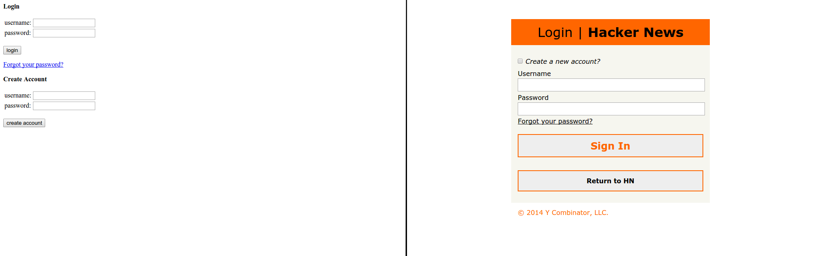

# Self-Critique
## Login Form Redesign
### Oct. 31, 2014

For this project, I chose to redesign the [Hacker News](https://news.ycombinator.com/) [login/signup form](https://news.ycombinator.com/login?whence=news). Here's what it looked like before and after:

You can view the form live here:

* <http://erictendian.github.io/com327/login-redesign/>
* <http://erictendian.github.io/com327/login-redesign/?status_message=Bad%20login.> (with a status message)

I chose to do the Hacker News login form as this was the most basic combination login/signup form I could find - the HTML was very basic, making use of tables for layout, and it was not particularly user-friendly or had much personality that the rest of the site has. The challenge was to make a better combination of the two forms, while still retaining a simple and hacker-ish feel that the original form had. To do this, I took the same color scheme from the main Hacker News site, the same flat design, and kept the form simple - no images, minimal JavaScript, and few buttons/actions.

I'm pleased with the final outcome of the project. It makes use of the Hacker News color scheme to give the login page the same feel as the rest of the site, while not adding too much extra flair. The design takes the existing login page and makes it even more simple in some aspects, combining the two sets of fields into one set, with an extra checkbox. Some may argue that this confuses the purpose of the page, but having the checkbox first gives it prominence for new users. Upon checking the "Create a new account?" checkbox, the page copy automatically switches from a login page to a signup page, done through CSS. This needs little JavaScript because I made use of CSS sibling selectors and the `content` property. There is also support for the status messages that the original form, taking on a terminal-like feel with a black bar and green monospaced text.

However, there are always ways to improve this project. First off, more emphasis could be placed on the checkbox for creating a new account - new users may be familiar with existing login/signup forms and do not immediately grasp the new design. Additionally, it could be argued that the old form's lack of styling actually made it more hacker-ish than the redesign. On the technical front, my CSS could be more minimal - I use two CSS resets, the first for all general HTML and the second to cover HTML5 and older browsers who may not have defined rules for the HTML5. Modernizr was also used, but in order to keep the asset size small I need to do more testing and figure out if I need the entire library for cross-browser support. In terms of accessibility, I do use `<label>` HTML tags and the `aria-required` attribute, but it needs additional testing with screen readers to ensure the form is very accessible. Finally, I could make my grid more sophisticated by going up to 6 or 12 columns instead of just 3. However, it seems this form works well with just 3 or even 2 columns max.

Regardless, I had fun on this project and it serves the purpose of a combination login+signup form, submitting data to the actual Hacker News form.
